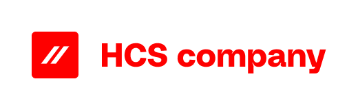

We are HCS Company, an IT company with a mission – making innovations more human using enterprise and open-source technology.
We go out of our way to help our clients optimally utilize their hybrid platforms. In the areas of Containerization, Automation, Observability, and Enablement. Together. With our team. With the client. Powered by teamwork.

[HCS Company site](https://www.hcs-company.com)

Fika.works is a community first, company second. We believe that a cooperative structure helps our members be the best version of themselves.
Fika.works specializes in cloud native consultancy. All our members have extensive experience in their fields.

[Fika Works site](https://fika.works)

ACC ICT specializes in IT continuity. Since 1977, we have stood for quality and technological advancement. Whether you're speaking with a colleague from technology, marketing, or sales, you'll notice that everyone is passionate about their field. That passion also drives us to make everything open for discussion, regardless of position. We believe that transparency, honesty, and respect form the foundation of a sustainable partnership.

[ACC ICT site](https://acc-ict.com)
