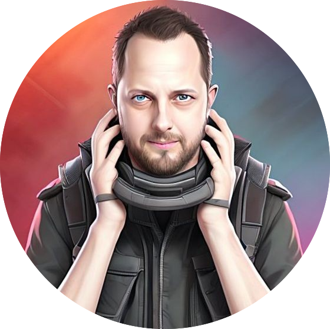

Ronald Kers is a seasoned IT professional with over 20 years of experience across systems administration, cloud infrastructure, and community engagement. As a CNCF Ambassador and co-founder of Stichting Cloud Native Netherlands, he is passionate about making complex technologies accessible and building inclusive, open communities. Ronald also co-hosts De Nederlandse Kubernetes Podcast, where he brings Kubernetes topics to life for Dutch-speaking tech audiences. His focus lies in promoting cloud native technologies, open source collaboration, and strengthening the Dutch cloud native ecosystem. Ronald is the President of the foundation.
